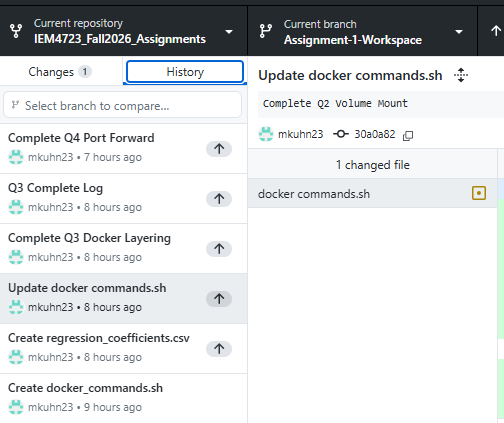

# IEM4723_Fall2026_Assignments
IEM 4723 Information Systems Design (Fall 2026) - assignment starter repositories

## Assignement 1 - Docker
### Docker Hub Repository

Docker Hub Repo:
https://hub.docker.com/r/mkuhn23/linear-regression-app

Image tags Q1:
- `linear-regression-app:latest`
- `linear-regression-app:v0.1.1`
- `linear-regression-app:v0.1.2`

### Branch History

Screenshots show the Git branch and 5 commits for Q1-4 (There were comlications with a sub commit, hence 1 additional commit)

