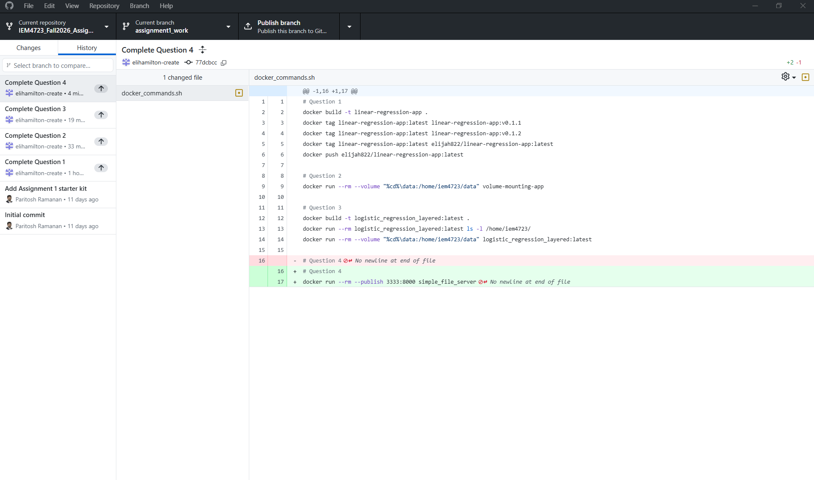

# IEM4723_Fall2026_Assignments
IEM 4723 Information Systems Design (Fall 2026) - assignment starter repositories

## Assignment 1 Deliverables

### Question 1 - Docker Hub Repository

Docker Hub Repository: https://hub.docker.com/r/elijah822/linear-regression-app

Image Tags:
- latest
- v0.1.1
- v0.1.2

### Branch History

