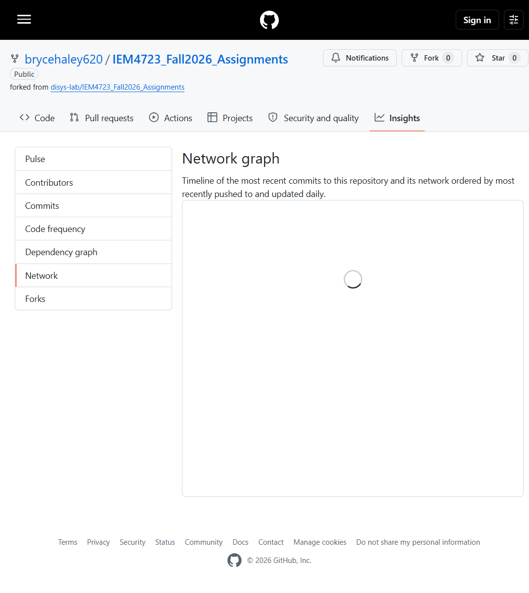
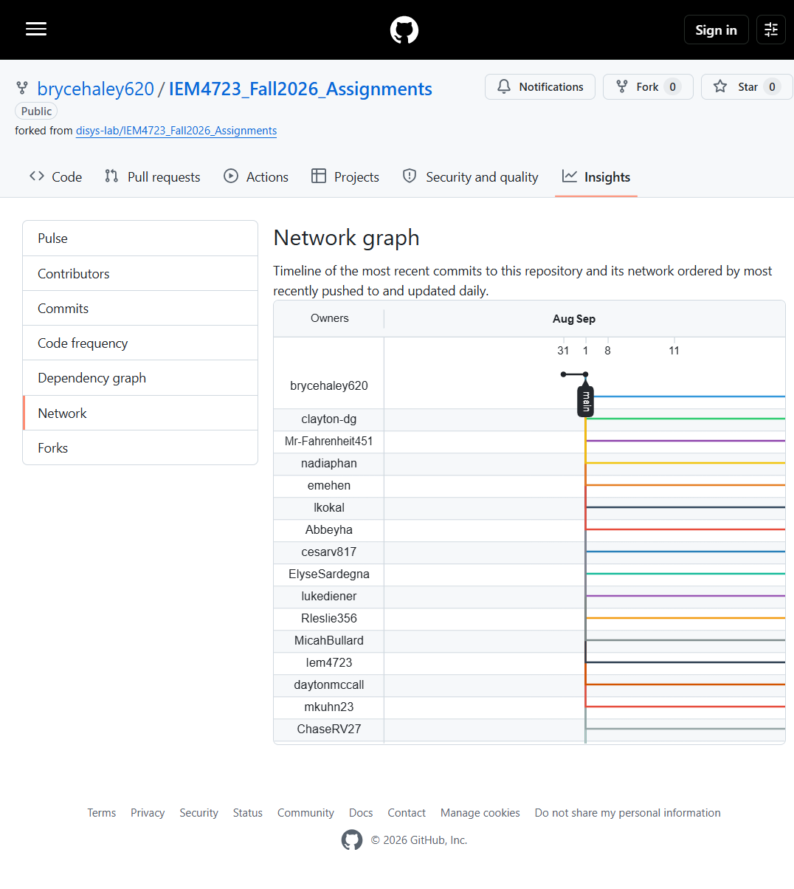
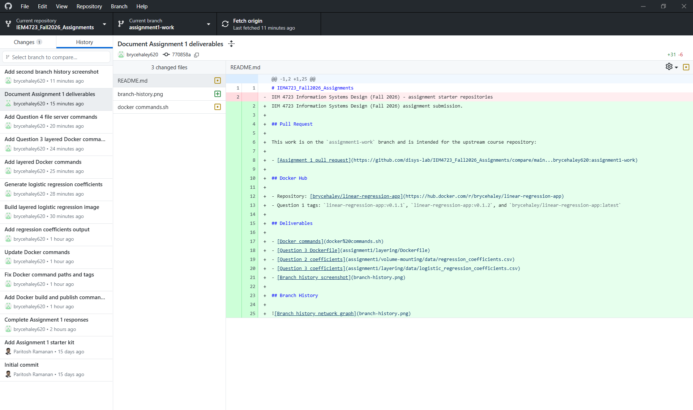

# IEM4723_Fall2026_Assignments
IEM 4723 Information Systems Design (Fall 2026) assignment submission.

## Pull Request

This work is on the `assignment1-work` branch and is intended for the upstream course repository:

- [Assignment 1 pull request](https://github.com/disys-lab/IEM4723_Fall2026_Assignments/compare/main...brycehaley620:assignment1-work)

## Docker Hub

- Repository: [brycehaley/linear-regression-app](https://hub.docker.com/r/brycehaley/linear-regression-app)
- Question 1 tags: `linear-regression-app:v0.1.1`, `linear-regression-app:v0.1.2`, and `brycehaley/linear-regression-app:latest`

## Deliverables

- [Docker commands](docker%20commands.sh)
- [Question 3 Dockerfile](assignment1/layering/Dockerfile)
- [Question 2 coefficients](assignment1/volume-mounting/data/regression_coefficients.csv)
- [Question 3 coefficients](assignment1/layering/data/logistic_regression_coefficients.csv)
- [Branch history screenshot](branch-history.png)
- [Additional branch history screenshot](branch-history-2.png)
- [GitHub Desktop history screenshot](branch-history-desktop.png)

## Branch History

